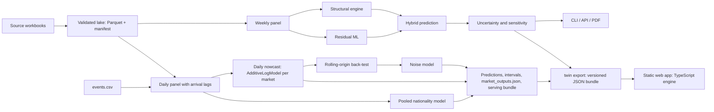

# Layers

## Diagram



## Packages

| Package | Holds |
| --- | --- |
| `src/tourism_twin/` | Pipeline and model |
| `src/app/` | Earlier web UI and JSON API (`server.py`, `static/index.html`); calls `config`, `domain`, `planning`, `nowcast.serving` |
| `src/audit_agent/` | Data-audit tool, run through `scripts/run_data_issues_audit.py`; input `meta/audits/data_issues/checklist.json`, output `audit/issues.md` (gitignored); does not import `tourism_twin` |

Non-code material: `meta/deck/` (slide content, fonts), `meta/research/` (research outputs written by `scripts/`), `meta/audits/` (audit checklist and dated records).

## `tourism_twin` layers

Lowest layer first. A package imports only from itself and the packages `tests/test_architecture.py` allows for it (`ALLOWED_IMPORTS`); `nowcast/` and `planning/` never import each other.

| Layer | Holds | May import |
| --- | --- | --- |
| `config.py` | Every filesystem path, env-overridable (stdlib only) | stdlib |
| `domain/` | Markets, archetypes, seasons, scenario types, event registry (`events.csv`) | domain |
| `features/` | `FeatureRegistry` and ratios, flags, calendar, lags | domain |
| `data/` | Ingest, validation, lake writer, manifest, `LakeRepository`, imputation, weekly and daily panels | config, domain, features |
| `models/` | Shared model kernel, no use case: protocol, registry, spec, handler, weighting, `components/`, linear solve, fitters, composite, back-test, evaluate, noise | config, domain, features |
| `nowcast/` | Daily competition model: specs, routing, baselines, predict, pooling, disaggregation, submission, weekly, outputs, serving, evaluation, same-day, outlook | config, domain, features, data, models |
| `planning/` | Weekly scenario model: structural, residual, calendar features, conformal, uncertainty, sensitivity, simulator, briefing, training, evaluation, specs, baselines, chain | config, domain, features, data, models |
| `reporting/` | Charts, prediction plot, solution PDF, database PDF, `deck/`, palettes | everything above |
| `export/` | `bundle.py`: the web bundle; sibling of `reporting/` | everything above |
| `cli/` | The `twin` command | everything above, `reporting`, `export` |

## Model kernel

```text
spec (data) ──► ComponentRegistry / FITTERS ──► DataHandler ──────────────────► AdditiveLogModel ──► Fitter
ModelSpec        names → fresh components        features (PANEL_FEATURES)        groups (market)       Backfitting / JointLinear
(nowcast/specs)  block of each component         row rules (named, in order)      log target            cycles components with
                                                 log target, training weights                           optional row weights
MarketRouter: DOMESTIC rows → one spec, every other market → another
```

| Layer | Module | Owns | Extended by |
| --- | --- | --- | --- |
| Registry | `models/registry.py` (`COMPONENTS`, `FITTERS`) | Names → factories; each component's block (`group`: flow, time, holiday, flight, residual) | `COMPONENTS.register(name, cls)` |
| Spec | `models/spec.py` (`ModelSpec`, immutable, validated at declaration); instances in `nowcast/specs.py` and `planning/specs.py` | Components, fitter, row rules and weighting of a model | A new `ModelSpec`, or `adding`, `without`, `replace_component`, `with_weighting` |
| Handler | `models/handler.py` (`DataHandler`, `RowRule`, `flagged`, `not_flagged`, `target_present`) | Feature resolution, training-row rules, log target, training weights | A new `RowRule` |
| Weighting | `models/weighting.py` (`Uniform`, `Recency`, `ByColumn`, `Product`) | Weight of each training row; one axis per class, combined by `Product` | A class with `weights(rows) -> Series` (positive, mean 1) |
| Evaluation | `models/evaluate.py` (`ModelCard`, `save_model`, `load_model`, `evaluate_fitted` → `Scorecard`); `twin evaluate-model` | Scores a saved model on later rows without refitting: WAPE, bias, MAE, RMSE, MSE, log-MSE per segment at day, week and month grain, error by horizon, direction of consecutive totals, interval coverage, optional per-entity table; refuses rows inside the training window | n/a |
| Model | `models/composite.py` (`AdditiveLogModel`) | Grouping, component copies per group, prediction, decomposition by component and by block | n/a |
| Fitter | `models/fitters.py`, `models/linear_solve.py` | Joint or backfitting solve; weighted least squares with penalty rows; LAPACK gelsd, QR gelsy when gelsd raises (Apple Accelerate) | `FITTERS.register(name, cls)` |
| Component | `models/components/` (`ComponentBase`, `LinearComponent`) | One additive log-scale term: `fit(panel, offset, y, weights=None)`, `contribution`, `explain` | One module + registry entry |

Weights:

| Fact |
| --- |
| Weights apply to the squared error of data rows; penalty rows are unweighted |
| Weights are relative: `w` and `3w` give the same fit; `weights=None` follows the unweighted code path exactly |
| The smearing factor is weighted like the fit |
| Centring of periodic terms is unweighted; the level owner absorbs the difference, predictions are unaffected |
| Weightings compare and hash by their settings; a spec stays a cache key after pickling |
| `POOLED_NATIONALITIES` uses `Recency(365)`; no market spec uses a weighting |
