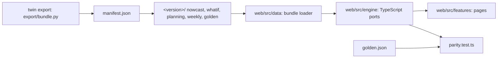

# Web bundle

## Diagram

## Bundle

`twin export` computes everything the web app reads once, at build time. No backend runs at request time.

| File | Contents |
| --- | --- |
| `manifest.json` | `schema_version`, `version` (`YYYYmmdd-HHMMSS-<git sha>`), `spec`, `coverage`, `predicted_period`, `files`, `sha256`; points at an immutable `<version>/` folder |
| `nowcast.json` | Daily predictions; AR(1) noise parameters and z for 50/80/90% per series; last 400 days of actual guests; nationality predictions |
| `whatif.json` | Per market and day: base stock, kernel flow from arrivals before and inside the predicted period, floor, calendar multiplier; no raw arrivals |
| `planning.json` | Calibration, archetype priors, season residual, conformal margins |
| `weekly.json` | Per calibrated market: actual weekly guests (complete weeks), structural part and residual for every panel week and 3 years beyond, the forward-holdout back-test (fitted before 2024-12-30) |
| `golden.json` | Input → expected output cases for the parity tests (`export/bundle.golden_part`, `planning_golden`) |

What-if: `guests_t = max(base_t + pre_t + f · in_t, floor) · multiplier_t`; a factor f on predicted-period arrivals is exact without raw arrivals.

| Fact |
| --- |
| Projected weeks in `weekly.json` use the calibrated seasonal seats; no growth term; holiday flags end with the week of 2027-02-08 (`calendar_flags_until`) |
| The Monte Carlo spread is not ported (numpy random stream); the web simulator shows the conformal band |
| Parity tolerance: 1e-9; what-if and range cases 1e-6 |
| A model change reaches the site through `make export` and a redeploy |

## Source layout (`web/src/`)

| Path | Holds |
| --- | --- |
| `app/routes.tsx` | Every route, once |
| `engine/` | Pure TypeScript. Ports: `planning`, `weekly`, `whatif`, `noise`, `range`. Page arithmetic: `insights`, `nowcastViews`, `playback`, `periods` (`periodAt`, `summarise`), `questions` (the five planning answers), `weekly.totalTimeline` (all markets summed). `parity.test.ts` |
| `data/` | Bundle loader (`bundle.ts`), `format.ts` |
| `components/{ui,layout,charts}` | Shared UI; chart theme `components/charts/theme.ts` |
| `features/landing`, `features/nowcast`, `features/report`, `features/questions` | Pages and the shared `QuestionAnswers` |
| `features/simulate/` | `SimulatePage.tsx` (shared state: market, levers reducer, week on the map, forecast start and growth); panes `LeverPanel.tsx`, `MapPlayback.tsx` (controlled week), `ResultsPanel.tsx`, `SeasonViews.tsx` (`ChainView`, `LeversView`), `TimelinePanel.tsx`, `NewRouteCard.tsx`; `EventStack.tsx` (event cards over the map); `eventCards.ts` (card stack state: `advance`, `jumpTo`, `tick`); `levers.ts` (`sliderAvailability`) |
| `theme/tokens.css` | Semantic colour tokens, light and dark |
| `content/` | `labels`, `landing`, `geo`, `report`, `questions` copy |
