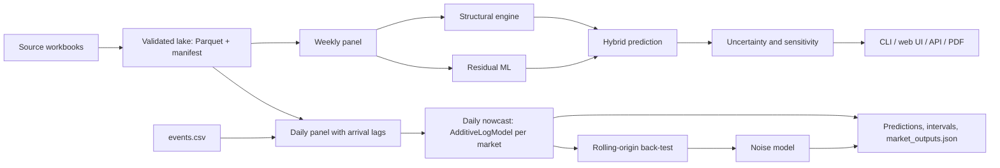

# Abu Dhabi Tourism Digital Twin — Solution and Technical Specification

**Challenge:** DCT Abu Dhabi — Advanced Technology Pioneers 2026 ([challenge statement](https://challengeon.atrc.ae/en/challenges/atp2026/pages/dct-challenge-statement?lang=en))
**Status:** working prototype: daily guest nowcast with test-split predictions and intervals (`twin predict`), weekly scenario simulator (CLI, web UI, JSON API), PDF reports, rolling-origin and forward-holdout back-tests, 98 automated tests.
**Run instructions:** [README](../README.md) and [user guide](user_guide.md).

## 1. Summary

Two models:

| Model | Inputs for the predicted period | Output | Command |
| --- | --- | --- | --- |
| Daily nowcast (`twin_daily`) | Daily new arrivals per market | Daily guests per market and nationality for 2025-08-01 to 2026-02-28, P10/P50/P90, weekly direction, implied stay | `twin predict` |
| Weekly planning model | Scheduled seats, planner levers, calibrated seasonal priors | Weekly guest lift per market and season | `twin simulate`, `twin serve` |

**Planning model.** It estimates how a change in air connectivity changes weekly hotel guests for a source market and season. A planner changes weekly frequency, aircraft gauge, seat capacity, load factor, P2P share, response multiplier or length of stay and gets:

- baseline vs. scenario at every step of the seats → guests chain;
- the lift attributed to each lever (waterfall);
- the structural lift plus a residual ML adjustment (hybrid);
- a P10/P50/P90 range and a tornado ranking of lever sensitivity;
- a plain-language briefing.

The planning model has two layers: a structural conversion chain calibrated per market and season, and a per-market residual model on calendar and event features only.

## 2. Problem

Flight data records departure country; hotel data records guest nationality. Arriving passengers may transfer, transit, be returning residents, stay with friends or relatives, or arrive overland. A change in seats therefore does not map one-to-one to hotel demand. Questions the tool answers:

- Hotel demand from a new twice-weekly route.
- Effect of a change in aircraft size or load factor.
- Guests generated per added seat, by market and season.
- Exposure of a market-season to a capacity cut.
- Which assumption drives the result most.

**Not in scope:** individual-traveler prediction or profiling; passenger itinerary reconstruction; causal claims from observational data; occupancy (no room-inventory data); identifying nationality, purpose or hotel choice from flight aggregates.

## 3. Challenge requirements

| Requirement | Implementation |
| --- | --- |
| Working simulator | `twin simulate`, `twin serve` (web UI + JSON API), Python API |
| Competition forecast | `twin predict`: `Guests` for every test-file row, validated against the test workbooks, with P10/P50/P90 |
| Adjustable conversion chain | 7 levers over seats → passengers → P2P → hotel arrivals → guests; every stage shown baseline vs. scenario |
| Historical validation | Daily nowcast: rolling-origin back-test (8 origins, 6-month horizon) against two baselines, held-out interval coverage, direction accuracy. Planning model: forward holdout (104 calibration weeks, 30 holdout weeks), 4-model benchmark |
| Sensitivity analysis | Tornado ranking; Monte Carlo P10/P50/P90 |
| Granularity | Nowcast: 21 markets daily, split to each nationality row of the test file. Planning: 21 markets × 4 seasons, weekly |
| Decision relevance | Generated briefing naming the lift, range and top driver |
| Reproducibility | Source hashes in `lake/manifest.json`, env-configurable paths, `make all` from raw workbooks, seeded deterministic Monte Carlo, tests |

## 4. Data

Source workbooks are read from `01a - DCT Dataset/` (organizer-provided, not redistributed; SHA-256 of each file in `lake/manifest.json`).

| Dataset | Grain and coverage | Fields | Use |
| --- | --- | --- | --- |
| International guests, train | Nationality-day, 2022-01-01 to 2025-07-31 | Guests, new arrivals, same-day guests | Nowcast training, calibration, back-tests |
| International guests, test | Nationality-day, 2025-08-01 to 2026-02-28 | New arrivals, same-day guests (Guests withheld) | Competition forecast inputs |
| Domestic guests, train/test | Day | Guests, new arrivals, same-day guests | Domestic nowcast; domestic planning prior |
| Flights | Route-airline-date, 2022 (monthly) and 2023-01-01 to 2026-02-28 (daily) | Seats, pax, P2P, transfer, transit, load factor, frequency, origin, airline | Structural chain |
| Data dictionary | 8-page PDF; documents the two test guest files and the flight file only, lists `Guests` in the test files (absent there), lists 6 international / 5 domestic columns (the files have 5 / 4) and calls the flight file monthly (daily from 2023) | Field definitions | Reference |

### 4.1 Lake (`twin build-lake`)

| Check (`lake/manifest.json`) | Value |
| --- | --- |
| `guest_daily` rows (1,520 dates × 45 nationalities + domestic) | 69,920 |
| Source-present guest rows / absent grid rows | 69,344 / 576 |
| Present rows, train / test | 59,930 / 9,414 |
| Flight rows total / daily (2023+) / monthly (2022) | 117,608 / 116,395 / 1,213 |
| Flight rows with load factor > 100% (kept, flagged) | 9,896 |
| Duplicate candidate keys (guest, flight) | 0, 0 |
| Passenger identity mismatches (`Total PAX = P2P + Transfer + Transit`) | 0 |

`twin build-lake` aborts unless duplicate keys, train rows missing `Guests`, test rows with `Guests`, passenger identity mismatches, rows with `new_arrivals > guests` and negative guest or arrival counts are all 0, and load factor equals pax ÷ seats within 1e-9 (`data/validation.py`).

### 4.2 Data findings that shape the model

1. Guests: 1,308 labeled days followed by 212 test days.
2. 45 guest nationalities vs. 33 flight departure countries; the fields are not semantically equivalent even when labels match. 12 nationalities have no flight-origin rows: Australia, Brazil, Czechia, Denmark, Finland, Mexico, Morocco, Norway, Pakistan, Romania, South Africa, Sweden.
3. 2022 flights exist on only 12 month-start dates; daily flights start 2023-01-01. Joint flight–guest modeling starts in 2023; 2022 flights are isolated in `flight_monthly.parquet`, so the `guest_flight_daily` view (joined to `flight_daily`) has NULL flight measures for 2022 dates (its load-factor outlier count is 0).
4. `*` in the source (suppressed / unavailable) is kept as null, never zero: 264 new-arrival and 39,428 same-day values, flagged by `is_suppressed_arrival` / `is_suppressed_same_day` (840 and 40,004 including the 576 absent grid rows, which are flagged too). Same-day guests never exceed guests.
5. Domestic demand is modeled separately; international flight changes do not create domestic guests.
6. Realized pax, P2P, load factor and new arrivals are valid for calibration but unknown before a future flight operates.
7. International train-split guests ÷ new arrivals = 3.61 (stock-to-flow ratio, not a measured length of stay).

### 4.3 Modeling panels

| Panel | Command | Grain | Contract |
| --- | --- | --- | --- |
| `weekly_market_panel.parquet` | `twin build-panel` | Market × Monday–Sunday week × split; 3,507 rows, 39 columns, week starts 2022-12-26 to 2026-02-23 | Flights and guests matched by date and market before weekly aggregation; weeks crossing the train/test boundary are split, not merged; `is_complete_week`, `is_complete_guest_inputs` flags; `load_factor_raw` kept unclipped with `is_load_factor_outlier`, `load_factor` clipped to [0, 1] |
| `daily_market_panel.parquet` (not committed) | `twin build-daily-panel [--max-lag K]` | Market × day, both splits; 31,920 rows (21 × 1,520) | Arrival lags `arrivals_lag_0..K` (default K = 21) built over the concatenated train + test series, so the first test days take lags from the last train days; `lag_complete` marks rows with a full lag window. A test-split nationality-day absent from the test file (the file keeps only rows with New Arrivals ≥ 10; 338 rows, mostly Finland, Norway, Denmark, Mexico, Azerbaijan) gets the nationality's mean training arrivals on days below 10 (4.5–6.1; 5.4 overall) and is counted in `n_arrivals_below_threshold`. Other suppressed or absent nationality-day arrivals are linearly interpolated within each nationality's series into `new_arrivals_filled` (counts in `n_arrivals_interpolated`, `n_absent_records`); observed `new_arrivals` leaves them missing, so weekly sums of daily `guests` and `new_arrivals` equal the weekly panel exactly (tested) |

Markets: the top 15 nationalities by training guest volume, 5 regional clusters (`OTHER_EUROPE`, `OTHER_ASIA_PACIFIC`, `OTHER_MENA`, `OTHER_AMERICAS_AFRICA`, `OTHER_EURASIA`) and `DOMESTIC`. Both panels use the same SQL market mapping (`build_market_case`).

The daily panel is the input of the daily nowcast (§7.5). `twin predict` and the back-test build it in memory from `guest_daily.parquet`.

Derived columns of both panels (ratios, flags, calendar fields, archetype, arrival lags) are defined once in `src/tourism_twin/features/` and resolved by `FeatureRegistry` in dependency order. Ratios are computed from summed parts at the panel's grain, never averaged. Both panel builders read the lake through `LakeRepository` (`data/repository.py`); the weekly panel's SQL runs on in-memory DuckDB views over the curated Parquet, so `twin build-panel` does not need `lake/analytics.duckdb`. The weekly planning model (structural, training, evaluation) reads `weekly_market_panel.parquet`.

## 5. Architecture



Package layout: [README §2](../README.md#2-architecture).

## 6. Operating modes

| Mode | Purpose | Allowed inputs |
| --- | --- | --- |
| Planning | Pre-flight decisions; what the simulator serves | Scheduled seats, planner levers, calibrated seasonal priors. No realized pax, P2P or hotel arrivals for the predicted period |
| Realized-chain (diagnostic) | Isolates error in the downstream stages | Realized P2P × calibrated multiplier × LOS |
| Nowcast | Predicting the withheld competition `Guests` (`twin predict`, `twin_daily`) | Test-period new arrivals, which the test files contain; no feature derived from `Guests` |

Results from different modes are reported separately.

## 7. Model

§7.1–7.4: weekly planning model (simulator). §7.5–7.9: daily nowcast (`twin predict`).

### 7.1 Structural chain (`planning/structural.py`)

Per market $m$ and season $s$, calibrated from the mean of weekly seats, pax, P2P, arrivals and guests in the training window:

```text
LF        = mean pax / mean seats
P2PShare  = mean P2P / mean pax
M[m,s]    = mean hotel arrivals / mean P2P        (effective response multiplier)
L[m,s]    = mean guests / mean hotel arrivals     (stay factor)

Guests = Seats × LF × P2PShare × M × L
```

- **Market bridge.** Departure country $k$ is linked to nationality $k$. $M_{m,s}$ absorbs non-national passengers, indirect connections and overland arrivals (e.g. via DXB). A full 45 × 33 country-to-nationality matrix (1,485 parameters) is not identifiable from aggregate weekly series and is not estimated.
- **Planning prediction** (`planning_guests`): scheduled seats × calibrated LF, P2P share, $M$, $L$. A served market whose seats carry no P2P passengers has zero aviation arrivals; an unserved market keeps its calibrated arrivals; `DOMESTIC` = calibrated arrivals × $L$, independent of seats. The simulator's baseline applies the same rule (`MarketSeasonParams.arrivals_from`).
- **Cold start.** A country without calibration gets its archetype's default LF, P2P share, $M$ and $L$ (`domain/archetypes.py`; unknown countries map to Emerging / Sparse).
- **Waterfall.** The scenario lift is attributed sequentially: seats, load factor, P2P share, multiplier, LOS. The five parts sum to the total lift (tested to < 1e-9 for every calibrated market, a cold-start market, all seasons and 6 lever sets). `simulate` raises if they differ by more than a relative 1e-9 (absolute 1e-6).

### 7.2 Residual ML (`planning/residual.py`, `planning/calendar_features.py`)

```text
Hybrid = max(0, planning_guests + residual)
```

One `RidgeCV` per market. Features: two week-of-year sine/cosine harmonic pairs, quarter dummies, winter and summer flags, holiday-week flag (Eid al-Fitr, Eid al-Adha, UAE National Day, New Year / festive weeks) and major-event-week flag (e.g. ADIPEC, Formula 1). Target: actual guests − `planning_guests`, so training and serving use the same structural prediction. In a scenario the residual is the mean fitted residual over the market's training weeks in that season, holidays and events included, matching the all-weeks seasonal baseline (stored as `season_residual` in `residual_engine.pkl`). No aviation inputs: the residual does not change with a capacity lever, so the hybrid lift equals the structural lift unless the max(0, ·) floor binds (tested: lift ≥ 0 for +2 flights in 5 markets).

### 7.3 Domestic demand

`DOMESTIC` uses its calibrated seasonal arrivals × LOS. Seat, frequency, load-factor and P2P levers have no effect; multiplier and LOS levers do (tested).

### 7.4 Uncertainty and sensitivity (`planning/uncertainty.py`, `planning/conformal.py`, `planning/sensitivity.py`)

| Component | Method |
| --- | --- |
| Monte Carlo (1,500 draws default) | Load factor and P2P share ~ Beta (method-of-moments, sd 0.03 and 0.04); multiplier and LOS × Normal(1, 0.06) and Normal(1, 0.04); residuals by 4-week block bootstrap of the market's weekly training residuals. Seed derived from the scenario via SHA-256, so identical inputs give identical bands |
| Conformal margin | Per market: (1 − α) quantile of in-sample relative planning-mode error on the training window, α = 0.2 |
| Tornado | Guest swing for ±15% seats, ±4 pp LF, ±5 pp P2P share, ±10% multiplier, ±0.5 days LOS; cold-start markets use a reference route |

### 7.5 Daily nowcast (`nowcast/specs.py`, `models/components/`, `models/composite.py`)

One `AdditiveLogModel` per market: log guests is the sum of component contributions, and the prediction is exp of that sum (the conditional median).

```text
Guests_t = flow_t × exp(season_t + weekday_t + events_t + slope_t)

flow_t   = c_t + Σ_{k=0..21} w_k · NewArrivals_{t−k}
```

| Component | Form | Domestic (`domestic_nowcast`) | International (`intl_nowcast`) |
| --- | --- | :---: | :---: |
| `ArrivalsConvolution(K=21)` | Contribution log(flow_t). w_k = share of arrivals still staying after k nights: w = U d with d ≥ 0 (non-increasing), Σd ≤ 1 (w₀ ≤ 1). c_t ≥ 0 is a base stock, piecewise linear between knots about 365 days apart with a first-difference penalty, flat beyond the training days. Bounded least squares, then SLSQP when Σd > 1, then projection onto Σd ≤ 1 if the solver stops short. Owns the level | ✓ | ✓ |
| `CentredSlope` | Log-linear slope in years since the first training day, centred on the training rows; flat beyond the last training day | ✓ | — |
| `AnnualFourier(4)` | 4 sine/cosine pairs of day of year, centred | ✓ | ✓ |
| `DayOfWeek` | One effect per weekday (Monday reference), centred | ✓ | ✓ |
| `EventKernel` | One coefficient per window day per event type from `domain/events.csv`; second-difference smoothing for windows of 6+ days, weight scaled by occurrences; zero outside the windows | — | ✓ |

- **Fitting** (`models/fitters.py`): `Backfitting`, kernel first (it owns the level). Every block minimises the same penalised log-scale objective, Σ(y − Σ contributions)² plus each component's penalty (the base-stock penalty is made unitless by the first pass's mean target, fixed for the fit): the kernel starts from a least-squares solve on the original scale and is refined on the log objective under its constraints, keeping the result only if it does not raise it; the linear components are one jointly solved block on y − log flow. The penalised objective therefore never increases (the SSE alone can rise slightly when a penalty falls), and fits converge (largest contribution change < 1e-6; cap 200 passes, not reached in the back-test). `FitReport.objective` records it per pass. The domestic weekday choice is reproducible with `scripts/compare_domestic_weekday.py`; its 13 origins include the 8 published ones. `domestic_time` has only linear components and uses `JointLinear` (one least squares).
- **Training rows**: `lag_complete` rows with guests; rows flagged `is_one_off_period` (the `international_shock_2022` window, international markets only) are excluded.
- **Inputs**: `arrivals_lag_0..21` from `new_arrivals_filled` (suppressed or absent nationality-day arrivals interpolated). Lags run across the train/test boundary, so the first test days use the last training days' arrivals.
- **Router**: `MarketRouter` serves `DOMESTIC` with `domestic_nowcast` and the other 20 markets with `intl_nowcast`.
- **Other daily specs** (`DAILY_SPECS`): `naive_364` (same market, same weekday 364 days earlier, stepping back whole years until the date is in training); `arrivals_ratio` (new arrivals × the market's training guests ÷ new arrivals); `twin_daily_gbm` (`twin_daily` + `ResidualGBM` on weekday, month, ISO week, holiday week, arrivals lags 0 and 7, fitted once after convergence; not shipped, §9.3); `domestic_time` (`LocalLevel` + season + weekday by season + events, for when arrivals are unknown; the level is a Whittaker smoother, flat beyond the training days).

### 7.6 Intervals (`models/noise.py`)

Fitted on the log errors e = log(actual) − log(pred) of the spec's rolling-origin back-test. Per market, errors along the horizon h (days from the forecast origin, h = 0 the first day) follow e_h = φ e_{h−1} + η_h, with first-day variance v₀:

```text
var(h) = v₀ φ^(2h) + σ_η² (1 − φ^(2h)) / (1 − φ²)
bounds = pred × exp(± z · sqrt(var(h))),   z = Φ⁻¹(0.9) for 80%
```

`twin predict` fits it on 8 monthly origins (2024-07-01 to 2025-02-01) with a 7-month horizon, the length of the test period, and counts h from 2025-08-01. No month or bias factor.

**Sums.** The interval of a sum over days (a week, any date range) uses the AR(1) covariance of the daily log errors, cov(eᵢ, eⱼ) = φ^|hᵢ−hⱼ| · var(min(hᵢ, hⱼ)), with the sum's log error the prediction-weighted mean of the daily ones (`NoiseModel.range_interval`). The daily total over all markets (`test_total_guests.csv`) has its own error series, `TOTAL`, fitted on the back-test predictions summed per fold and day, because errors are correlated across markets. Its 80% interval covers 80.9% of back-test days (leave one origin out) and 79.4% (±3 months excluded); adding the 21 markets' bounds instead covers 98.7%.

### 7.7 Nationality split (`nowcast/disaggregation.py`)

A pooled market's prediction is split across its nationalities by share = (trailing 7-day new arrivals × the nationality's training guests ÷ new arrivals ratio), normalised per market and day. Splitting actual market guests over the last training year this way gives a nationality WMAPE of 14.0%, against 24.0% for shares of same-day arrivals. Nationality bounds add the split's log-error variance (s.d. 0.18–0.25 per pooled market, last 365 training days) to the market's.

### 7.8 Derived outputs (`nowcast/outputs.py`)

`market_outputs.json`, computed from the fitted model and its intervals only:

| Output | Definition |
| --- | --- |
| Weekly forecast | Sum of daily predictions over a full Monday–Sunday week |
| p10, p90 | Forecast × exp(∓z · s.d.); the week's log error is the forecast-weighted mean of daily log errors with cov(eᵢ, eⱼ) = sdᵢ · sdⱼ · φ^\|i−j\| (AR(1), per-market φ from the noise model) |
| Direction, probability | Sign of the log change to the next week; probability from the s.d. of the difference of the two weeks' log errors under the same covariance |
| Year-on-year change | Forecast ÷ actual guests of the week 364 days earlier − 1 |
| Top drivers | Up to 3 season and event effects ≥ 0.5% by mean log contribution in the week, as % effects |
| Trend vs training | Domestic slope contribution relative to the training mean, extrapolated |
| Implied mean stay, short-stay share | Σ w_k and 1 − w₂ / w₀; withheld when the base stock carries more than 25% of the training stock (7 of 21 markets) |


### 7.9 Same-day guests (`nowcast/same_day.py`)

`SameDayPoisson`: one Poisson GLM per market on weekday, holiday week and log(1 + new arrivals); markets with fewer than 60 training days use their mean. A suppressed nationality value (`*`) counts as 0: no observed same-day value is 0, observed counts fall from 1 (6,814 rows) to 2 (5,179) to 3 (2,967), and suppressed days have lower arrivals (CHINA median 328 vs 501). `same_day_backtest` scores it on rolling origins (`scripts/same_day_backtest.py`). Not called by `twin predict` (the test workbooks contain `Same-Day Guests`).

## 8. Archetypes

Seven archetypes assigned per market in `domain/archetypes.py`: Direct Leisure, Resident / VFR, Regional GCC, Hub-Mediated, Highly Seasonal, Emerging / Sparse, Domestic Staycation. Each carries default LF, P2P share, multiplier and LOS used for cold start. They describe aggregate market behavior, not traveler demographics. Per-market assignment: [user guide §5](user_guide.md#5-market-directory).

## 9. Validation

### 9.1 Design (weekly planning model)

- Single forward split over complete train-split weeks with complete guest inputs: calibration 2023-01-02 to 2024-12-23 week starts (104 weeks, 2,132 market-weeks); holdout 2024-12-30 to 2025-07-21 week starts (30 weeks, 621 market-weeks, 21 markets). No random splits.
- `twin evaluate` fits the shipped trainers (`StructuralEngine.calibrate`, `ResidualMLEngine.fit`, `calibrate_conformal`) on the calibration window only.
- WMAPE = Σ|actual − predicted| / Σ actual. Bias = (Σ predicted − Σ actual) / Σ actual; positive = over-forecast.
- Baselines: (1) market-season mean of training guests; (2) per-market ridge on calendar features only; (3) structural planning prediction; (4) hybrid.
- Output: `lake/curated/evaluation_results.json`.

### 9.2 Results

Weekly planning model, forward holdout.

| Setting | WMAPE | Bias | MAE | RMSE |
| :--- | :---: | :---: | :---: | :---: |
| International planning | 27.52% | +1.52% | 2,466.5 | 3,920.7 |
| International realized-chain | 24.54% | −5.67% | 2,199.9 | 3,308.7 |
| Domestic forecast | 16.04% | +13.05% | 17,485.2 | 21,078.9 |
| Combined planning | 23.14% | +5.93% | 3,192.1 | 6,007.8 |
| Combined realized-chain | 21.30% | +1.48% | 2,938.3 | 5,646.6 |

| Model (all markets) | WMAPE | Bias | MAE | RMSE |
| :--- | :---: | :---: | :---: | :---: |
| 1. Historical seasonal prior | 23.00% | −6.60% | 3,172.8 | 6,156.5 |
| 2. Pure ML / calendar | 22.00% | −8.50% | 3,035.6 | 5,839.0 |
| 3. Structural only | 23.14% | +5.93% | 3,192.1 | 6,007.8 |
| 4. Hybrid digital twin | **21.74%** | **+5.36%** | **2,999.2** | **5,673.6** |

Combined planning mode by season (structural prediction):

| Season | Market-weeks | WMAPE | Bias |
| :--- | :---: | :---: | :---: |
| Winter_Peak | 292 | 27.92% | +9.65% |
| Spring_Shoulder | 168 | 21.24% | +4.86% |
| Summer_Trough | 161 | 16.40% | +0.23% |

Autumn_Shoulder is not in the holdout window. Per-market results are in `market_breakdown` of `evaluation_results.json`.

Findings:

1. The hybrid model is best on all four metrics (`benchmark_leaders`; bias by absolute value). Its WMAPE lead over the calendar-only model is 0.26 pp.
2. The structural-only engine (23.14%) does not beat the seasonal prior (23.00%) on WMAPE.
3. International planning mode, which uses no realized operational data, has 27.52% WMAPE and +1.52% bias.
4. The domestic prior over-forecast the holdout by 13.05%: 2025 domestic guests were below the 2023–2024 seasonal level.
5. Interval coverage: 65.2% of holdout market-weeks fall inside structural prediction × (1 ± conformal margin), against a nominal 80%.

### 9.3 Daily nowcast

**Design.** `RollingOrigin`: 8 monthly origins, 2024-07-01 to 2025-02-01; each fold trains on days before its origin and tests the next 6 months (folds overlap in calendar time). A fresh model is fitted per fold (`models/backtest.py`). WMAPE is computed per fold over the market-days of each segment (domestic; the 20 international markets), then averaged over folds. A component stays only if it lowers WMAPE by ≥ 0.3 pp on both segments.

| Spec | Domestic WMAPE | International WMAPE |
| --- | :---: | :---: |
| `naive_364` | 20.4% | 26.6% |
| `arrivals_ratio` | 15.9% | 19.2% |
| **`twin_daily`** (shipped) | **6.2%** | **9.4%** |
| `twin_daily_gbm` | 6.2% | 9.1% |

The residual GBM lowers international WMAPE by 0.33 pp and domestic by 0 (domestic has no GBM), so it fails the both-segments rule and is not shipped.

**Interval coverage** of the 80% interval, `twin_daily`, each fold's bounds from a noise model fitted on other folds only:

| Folds used to fit | All | Domestic | International |
| --- | :---: | :---: | :---: |
| All other origins | 81.4% | 81.5% | 81.4% |
| Origins more than 3 months away | 79.2% | 75.9% | 79.4% |

International coverage is 79–83% at every horizon. Domestic coverage falls from 89% (h ≤ 13 days) to 74% (h > 120 days).

**Direction** (week-to-week on the 8 origins of `twin predict`'s interval back-test, 1,154 distinct market-weeks, each from its earliest origin). The model sees observed new arrivals, so this is nowcast skill:

| Predictor | Accuracy |
| --- | :---: |
| Model | 87.2% |
| Direction of new arrivals | 83.4% |
| Same direction as last year | 63.1% |
| Market's majority training direction | 53.6% |

Stated `direction_prob` vs share right: 0.55 → 63%, 0.65 → 78%, 0.75 → 82%, 0.85 → 91%, 0.98 → 99%. Weekly 80% bands cover 77.6% of back-test weeks. The noise model is fitted on the same folds, so both figures are in-sample for the error model.

**Same-day guests** (`same_day_backtest`, 8 origins 2024-07..2025-02, 6-month horizon, mean Poisson deviance, lower is better, suppressed values as 0): domestic 11.8 vs 15.3 for the market mean; international 4.87 vs 5.61.

**Block ablation** (`twin ablate-blocks`, 13 monthly origins 2024-02-01..2025-02-01, WAPE % of daily segment totals; domestic / international): seasonal naive 18.80 / 19.28; time only 9.23 / 9.62; flow only 8.92 / 5.06; flow + time 5.97 / 4.19; flow + time + holiday (`twin_daily`) 5.97 / 4.12 (domestic with the slope extrapolated linearly; held flat, 5.46).

**Base stock tied to arrivals** (`twin_daily_base90`, not shipped): c_t = ρ × trailing 90-day mean arrivals; domestic 11.23% (linear slope), international 13.39%.

**Domestic slope beyond training** (13 origins 2024-02..2025-02, daily WAPE / bias): linear 5.97% / −2.61%; damped over 180 days 5.76% / −2.01%; over 90 days 5.66% / −1.63%; flat 5.46% / −0.36%; no slope 8.72% / +7.27%. `CentredSlope` holds the trend flat beyond the last training day by default.

**Market-scoped events** (folds 2024-08..2025-01, which contain the windows; market daily WAPE without / with): Chinese New Year for CHINA 16.47% / 16.78%; Morocco winter long stays for OTHER_AMERICAS_AFRICA 11.28% / 13.42%. Both are in `events.csv` with their market scope and neither is in the default event kernel.

**Time-varying survival curve** (not shipped): per-regime curves 8.72% overall WMAPE vs 8.39% for one shared curve × calendar (both measured with the earlier raw-scale kernel fit; the shipped fit now scores 8.31%); recency weighting destabilised domestic. `twin_daily` uses one curve per market.

**Fit diagnostics.** All 168 fits (21 markets × 8 origins) converge; `BacktestResult.diagnostics` counts non-converged fits. Domestic results are identical for caps of 20, 50, 200 and 1,000 passes (13 rolling origins 2024-02..2025-02, daily WAPE 5.97%).

## 10. Tests

77 tests: 53 in `tests/test_tourism_twin.py` (lake, feature registry, panels and their reconciliation, synthetic recovery for every model component, event registry, back-test harness leakage and parity with `evaluation_results.json`, noise model, architecture layering, prediction validator and outputs, same-day GLM, scenario invariants) and 24 in `tests/test_audit_agent.py`; all pass on a fresh clone. Details: [user guide §10](user_guide.md#10-tests).

## 11. Limitations

| Limitation | Consequence | Current handling |
| --- | --- | --- |
| Departure country used as proxy for nationality | Misallocated market impact | Calibrated effective multiplier; planner-adjustable; documented |
| Planning-model interval coverage 65.2% vs. 80% nominal | Simulator P10–P90 ranges are too narrow on the 2025 holdout | Coverage reported with every briefing; the simulator still uses the conformal margins |
| Domestic prior over-forecast 2025 by 13.05% | Domestic baseline too high for 2025 conditions | Reported; domestic modeled separately |
| Stay factor $L$ is a stock-to-flow ratio, not a measured length of stay | LOS lever is an approximation | The nowcast's survival curve is not used by the simulator |
| Nowcast implied stay Σw understates the guests ÷ new arrivals ratio where the base stock c_t carries part of the stock | `implied_mean_stay_days` is not a measured stay | `base_stock_share` exported; stay fields withheld above 25% (7 of 21 markets) |
| Domestic nowcast interval coverage falls with horizon (90% at h ≤ 13 days, 71% at h > 120) | Late test-period domestic bounds are too narrow | Reported; no horizon-specific correction |
| Nationality split of pooled markets is a modelled share | Extra error per nationality (split WMAPE 14.0%) | Split variance added to nationality intervals |
| Structural-only accuracy does not beat the seasonal prior | Structural chain is for scenario attribution more than for point forecasting | Hybrid reported alongside |
| Cold-start markets use archetype defaults | Weak estimates for new origins | Flagged `is_cold_start` in results |
| No room inventory | Occupancy cannot be reported | Output is guests, not occupancy |
| No bookings, room rates, marketing spend, airfares, visa or macroeconomic data | Demand drivers beyond arrivals and the calendar are not modelled | Stated as a scope limit |
| Planning model validated on a single forward split | One holdout period; no Autumn_Shoulder weeks | Season breakdown reported |
| Observational data | No causal identification | Results described as planning estimates |

Design evidence for the nowcast: [model design](model_design.md).

## 12. Open questions for the organizers

1. Are the 2022 flight records intended to be monthly and later records daily?
2. Does an absent nationality-day row mean zero guests or a missing report? (The dictionary does not say; 576 grid rows are absent.)
3. Will room inventory, occupancy, events, aircraft type or schedule files be provided?
4. Is the competition forecast scored on international and domestic guests jointly or separately?
5. Is hotel `Guests` an end-of-day stock, a daily occupied-guest count, or another convention?
6. Should a new route be allocated to nationality markets by planner input, a comparable-market prior, or both?

## 13. Responsible use

The data is aggregated and contains no passenger-level information. Outputs describe expected aggregate relationships and must not be used to infer individual behavior or protected characteristics. The simulator supports planning; it does not establish causal effects.

## 14. References

- [DCT Abu Dhabi challenge statement](https://challengeon.atrc.ae/en/challenges/atp2026/pages/dct-challenge-statement?lang=en)
- `01a - DCT Dataset/Data_Dictionary.pdf` (organizer-provided; not in the repository)
- [`../lake/manifest.json`](../lake/manifest.json)
- [`../README.md`](../README.md)
